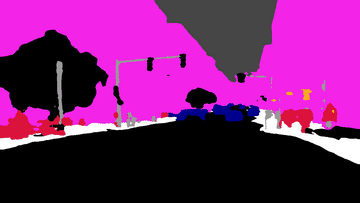
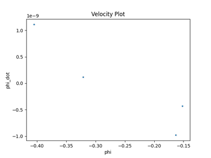

# Multi-Sensor 3D Object Detection & Tracking (Camera + LiDAR + Radar)

A complete perception pipeline that fuses **camera**, **LiDAR**, and **radar** data from the [nuScenes](https://www.nuscenes.org/) I have onyl used a sample from it. This Dataset used to detect, fuse, and track 3D objects over time. The system runs per-sensor detectors, aligns everything into a single global timeline, cross-associates detections across sensors, tracks objects with a Kalman Filter / Extended Kalman Filter, and evaluates tracking quality against ground truth using standard MOT (Multi-Object Tracking) metrics.

Maybe the results of the evaluation not that good but it can be optimized.

---

## Table of Contents

1. [Overview](#overview)
2. [Why Sensor Fusion?](#why-sensor-fusion)
3. [Architecture](#architecture)
4. [Repository Structure](#repository-structure)
5. [Data: nuScenes](#data-nuscenes)
6. [Pipeline Stage 1 — Per-Sensor Detection](#pipeline-stage-1--per-sensor-detection)
   - [Camera Pipeline](#camera-pipeline)
   - [LiDAR Pipeline](#lidar-pipeline)
   - [Radar Pipeline](#radar-pipeline)
7. [Pipeline Stage 2 — Geometric Fusion & Timeline Construction](#pipeline-stage-2--geometric-fusion--timeline-construction)
8. [Pipeline Stage 3 — Cross-Sensor Association (Hungarian Algorithm)](#pipeline-stage-3--cross-sensor-association-hungarian-algorithm)
9. [Pipeline Stage 4 — Multi-Object Tracking (Kalman Filter / EKF)](#pipeline-stage-4--multi-object-tracking-kalman-filter--ekf)
10. [Pipeline Stage 5 — Evaluation](#pipeline-stage-5--evaluation)
11. [Pipeline Stage 6 — Visualization](#pipeline-stage-6--visualization)
12. [Installation](#installation)
13. [Usage](#usage)
14. [Output Artifacts](#output-artifacts)
15. [Tunable Parameters](#tunable-parameters)

---

## Overview

Autonomous driving perception stacks rarely rely on a single sensor: cameras give rich semantic information (class, lane markings, drivable area) but poor depth/velocity; LiDAR gives precise 3D geometry but no semantics or reliable velocity; radar gives direct radial velocity (Doppler) and works in fog/rain/darkness but is sparse and noisy. This project builds a pipeline that:

1. Runs independent detectors on each sensor's raw data (camera images, LiDAR point clouds, radar sweeps).
2. Converts every detection into a **common global coordinate frame** using the ego vehicle's pose and each sensor's extrinsic/intrinsic calibration.
3. Merges all detections into a single **time-ordered event stream**.
4. Cross-associates camera detections with LiDAR/radar detections that are nearby in time and space (via projection + the Hungarian algorithm), producing "fused" objects that carry class, position, and velocity.
5. Feeds the whole stream into a **multi-object tracker** built on a Kalman Filter (linear, constant-velocity) or an Extended Kalman Filter (handles native radar polar measurements: range, bearing, range-rate).
6. Evaluates the resulting tracks against nuScenes ground-truth annotations using MOTA/IDS/Precision/Recall/F1.
7. Renders the tracked 3D boxes back onto the camera video for visual inspection.

```
      The code that generated timeline won't exist in actuall life as 
      i made it to simulate the changing rates of the sensors could be
      replaced by using **ROS** and changing the rate

```
## Why Sensor Fusion?

| Sensor | Strengths | Weaknesses |
|---|---|---|
| **Camera** | Class/semantics, lane lines, dense texture, cheap | No direct depth, no direct velocity, sensitive to lighting/weather |
| **LiDAR**  | Accurate 3D position, works at night, dense point geometry | Expensive, sparse at range, no semantics, no velocity, poor in heavy rain/fog |
| **Radar**  | Direct radial velocity (Doppler), robust in fog/rain/dark, long range | Sparse, noisy angular resolution, weak semantics, no elevation in many sensors |

Fusing all three lets the tracker use the position accuracy of LiDAR, the velocity signal of radar, and the classification/appearance confirmation of camera — producing tracks that are more robust than any single sensor alone.

```
                 ┌───────────┐
                 │  CAMERA   │  → class, 2D bbox, lane lines, semantic mask
                 └───────────┘
                 ┌───────────┐
Raw nuScenes  →  │  LiDAR    │  → 3D box (x, y, z, dx, dy, dz, yaw), class, score
   sensor        └───────────┘
   sweeps        ┌───────────┐
                 │  RADAR    │  → range, bearing, radial velocity   (Doppler)
                 └───────────┘
                       │
                       ▼
         Geometric Fusion (transform to global frame)
                       │
                       ▼
            Unified time-ordered event timeline
                       │
                       ▼
   Cross-sensor association (project LiDAR/Radar → image, Hungarian match)
                       │
                       ▼
        Multi-Object Tracker (Linear KF or EKF, per-track history)
                       │
              ┌────────┴────────┐
              ▼                 ▼
        Evaluation (MOTA)   Visualization (video / plots)
```

## Architecture

The system is organized as a linear pipeline of independent, swappable stages. Each stage reads/writes JSON so it can be run, debugged, and cached separately:

```
raw nuScenes data
      │
      ▼
[1] Per-sensor detection  ──►  detections_xy.json (camera), detections_xy.json (lidar), radar_all_frames.json
      │
      ▼
[2] Geometric fusion / TimelineBuilder  ──►  data_with_timestamps.json (single unified file — every radar
    object carries both Cartesian and polar fields, so it feeds every tracking mode)
      │
      ▼
[3] MultiObjectTracker.run(events)
      │  (internally calls CrossSensorFusion + Hungarian matching + Kalman/EKF update per event)
      ▼
tracks_output.json
      │
      ├──► [4] Evaluator → evaluation_results.json (MOTA, IDS, TP/FP/FN, Precision, Recall, F1)
      └──► [5] camera_overlay_video → tracking_video.mp4
```

## Repository Structure

```
.
├── main.py                                  # CLI entry point — orchestrates tracking, evaluation, visualization
├── _helper.py                               # Paths, argparse config, event-loading & validation helpers
│
├── camera_pipeline/
│   ├── general_detection_yolo_model/
│   │   └── yolo_detector.py                 # MultiYOLODetector — 2 custom YOLO models for traffic lights and traffic signs + COCO YOLO for vehicles
│   ├── lane_line_det/
│   │   └── UDLF.py                          # UltrafastLaneSegmenter — lane-line detection & masking could be used also as a feedback to stay in the lanes
│   └── semantic_seg_SegFormer/
│       └── seg_former.py                    # SegFormerSegmenter — Cityscapes semantic segmentation
│
├── lidar_3d_det/
│   ├── 3d_det_pointpillar.py                # PointPillars3DRenderer — 3D detection + 3D/BEV rendering I used this model as i have precious used PCL just to experience new things actually it's stable for detection more than PCL
│   ├── _helpers.py                          # BEV pixel-space helper functions
│   ├── config.py                            # nuScenes class list, vehicle subset, color maps
│   └── vis_sample.py                        # Quick Open3D point-cloud viewer for one .bin sweep
│
├── radar_preprocessing/
│   └── radar_preprocessing_ete.py           # Radar sweep → polar (rho, phi, phi_dot) + per-frame JSON + GIFs
│
├── geometric_fusion/
│   ├── transforms.py                        # Quaternion math, sensor↔global frame transforms, pinhole projection (if you're using ROS most of these functions are built in there)
│   └── timeline.py                          # TimelineBuilder — merges all sensors into one global event stream (The alternative of using real sensor data with different rates)
│
├── hungarian_algorithm/
│   └── hungarian_matching.py                # CrossSensorFusion — projects LiDAR/Radar into camera & matches via Hungarian
│
├── kalman_filter/
│   ├── linear_kf.py                         # LinearKalmanFilter — constant-velocity CV model
│   ├── ekf.py                               # ExtendedKalmanFilter — adds nonlinear polar radar update
│   └── tracker.py                           # Track + MultiObjectTracker — the main tracking loop
│
├── evaluation/
│   ├── metrics.py                           # MOTMetrics — MOTA / IDS / TP / FP / FN / Precision / Recall / F1 (I've used Nuscenes GT data  but i guess i have something missing should be optimized soon)
│   └── evaluator.py                         # Evaluator — aligns tracks to nuScenes GT annotations, scores them
│
└── visualization/
    └── visualizer.py                        
```

## Data: nuScenes

This project is built around the **nuScenes `v1.0-mini`** dataset. It expects the standard nuScenes folder layout, in particular:

- **Sensor sweeps**: `sweeps/LIDAR_TOP/*.pcd.bin`, `sweeps/RADAR_FRONT/*.pcd`, and `CAM_FRONT` images.
- **Calibration / metadata JSON tables** (nuScenes "Calibration Files" — really the full metadata split):
  - `sensor.json` — sensor definitions (channel names like `CAM_FRONT`, `LIDAR_TOP`, `RADAR_FRONT`) 
  - `calibrated_sensor.json` — extrinsic (rotation/translation) + intrinsic (`camera_intrinsic`) calibration per sensor, per keyframe
  - `ego_pose.json` — ego-vehicle pose (rotation/translation) in the global frame at each timestamp
  - `sample_data.json` — the index tying every sensor file to a timestamp, sensor, and ego pose
  - `sample.json` — keyframe (~2 Hz) sample tokens and timestamps used for ground-truth alignment
  - `sample_annotation.json` — 3D ground-truth boxes per keyframe (position, instance, category)
  - `instance.json` / `category.json` — object identity and class-name lookup tables

**The data contains more than camera_front and radar_front it has 5 folders for the camera but i though using all of them will require panoramic image and BEV for them and then the fusion will be harder so i tried to simplify it as the main purpose of the code were educational.**

All coordinate transforms (sensor → ego → global) follow the standard nuScenes convention: rotations are quaternions `[w, x, y, z]`, and each sensor reading is first rotated/translated into the ego frame using `calibrated_sensor`, then into the global frame using `ego_pose`.

---

## Pipeline First Stage — Per-Sensor Detection

Each sensor modality is processed independently first. All three produce per-frame JSON files that the fusion stage later consumes. 

---

### Camera Pipeline

Three independent camera models run over each `CAM_FRONT` frame:

**1. Object detection — `camera_pipeline/general_detection_yolo_model/yolo_detector.py` (`MultiYOLODetector`)**
Runs *three* YOLO models per frame in an ensemble-style pass:
- Two custom-trained YOLO models (`model1`, `model2`) for domain-specific classes.
- A stock COCO-pretrained YOLO (`yolov8n.pt`) used specifically to extract **vehicle centers** (`car`, `truck`, `bus`, `motorcycle`) — these are the centers later matched against LiDAR/radar during fusion. and extracted that data into json file for each frame the detected objcets with the centers.


**2. Lane-line detection — `camera_pipeline/lane_line_det/UDLF.py` (`UltrafastLaneSegmenter`)**
Wraps the **Ultra-Fast-Lane-Detection** model (external dependency, imported as a local sub-package `ultrafastLaneDetector` — see [Installation](#installation)) to draw lane lines on each frame, and additionally exposes `extract_lane_mask()` which HSV-thresholds the rendered output into a binary white/yellow lane mask. This output is currently used for visualization/scene-understanding context rather than feeding the tracker directly.

**3. Semantic segmentation — `camera_pipeline/semantic_seg_SegFormer/seg_former.py` (`SegFormerSegmenter`)**
Uses a HuggingFace **SegFormer** model fine-tuned on Cityscapes (`nvidia/segformer-b2-finetuned-cityscapes-1024-1024`) to segment each frame into road, sidewalk, pole, traffic light, building, person, car, etc., producing a colorized segmentation map per frame. Like lane detection, this enriches scene context (e.g. drivable-area masks) alongside the object-centric detections.
<table>
  <tr>
    <td align="center"><b>Laneline Line</b></td>
    <td align="center"><b>Semantic Seg</b></td>
    <td align="center"><b>Road Surroundings Det</b></td>
  </tr>
  <tr>
    <td></td>
    <td></td>
    <td></td>
  </tr>
</table>

---

### LiDAR Pipeline

**`lidar_3d_det/3d_det_pointpillar.py` (`PointPillars3DRenderer`)**

Runs a **PointPillars** 3D object detector (via `mmdetection3d`'s `init_model` / `inference_detector`) over each `LIDAR_TOP` `.bin` sweep (5 features per point: x, y, z, intensity, ring). For every sweep:

1. Runs inference → 3D boxes (`gravity_center`, `dims`, `yaw`), per-box class label and confidence score.
2. Filters boxes below `score_thr` (default `0.3`) and keeps only vehicle classes (`VEHICLE_CLASSES` in `config.py`: car, truck, bus, trailer, construction_vehicle).
3. Emits `{"class", "x", "y", "score"}` per detection (LiDAR-sensor-frame coordinates at this stage) into a combined `detections_xy.json` keyed by sweep filename.


<table>
  <tr>
    <td align="center"><b>BEV Detection</b></td>
    <td align="center"><b>3D Detection</b></td>
  </tr>
  <tr>
    <td></td>
    <td></td>
  </tr>
</table>

---

### Radar Pipeline

**`radar_preprocessing/radar_preprocessing_ete.py`**

Reads every `RADAR_FRONT` `.pcd` sweep with `nuscenes-devkit`'s `RadarPointCloud`, and for each sweep:

1. Extracts compensated velocity components (`vx_comp`, `vy_comp` — i.e. velocity already corrected for ego motion) and filters to **moving targets only** (`dyn_prop == 0`).
2. Converts each point's Cartesian `(x, y)` to native radar measurement space:
   - `rho = sqrt(x² + y²)` — range
   - `phi = atan2(y, x)` — bearing
   - `phi_dot = (x·vy − y·vx) / rho²` 
   This conversion is not needed actually but i made it to use it like the Nanodegree of udacity and to be able to stufy EKF and apply on it.
   if the data is vx and vy there will be only linear equations so no need for EKF 

3. Saves every frame's raw points `{rho, phi, phi_dot, x, y, vx, vy}` into a single combined `radar_all_frames.json`.


<table>
  <tr>
    <td align="center"><b>Radar polar plot </b></td>
    <td align="center"><b>Radar Vel plot</b></td>
  </tr>
  <tr>
    <td></td>
    <td></td>
  </tr>
</table>

---

## Pipeline Stage 2 — Geometric Fusion & Timeline Construction

**`geometric_fusion/transforms.py`** implements the core coordinate-frame math shared by every later stage:

- `quat_to_rot(q)` — converts a nuScenes `[w, x, y, z]` quaternion into a 3×3 rotation matrix. 
- `sensor_to_global(p, calib, ego)` — chains sensor→ego (`calibrated_sensor`) then ego→global (`ego_pose`) transforms for a 3D point.
- `global_to_sensor(p, calib, ego)` — the inverse chain (used to reproject tracked objects back into a camera for association/visualization).
- `vel_sensor_to_global(vx, vy, calib, ego)` — rotates a 2D velocity vector from sensor frame into the global frame (translation doesn't apply to velocities).
- `project_to_image(p_cam, K)` — standard pinhole projection: `[u, v, w]ᵀ = K·[X, Y, Z]ᵀ`, then perspective-divides by `Z`; returns `None` if the point is behind the camera (`Z ≤ 0.1`).

**`geometric_fusion/timeline.py`** (`TimelineBuilder`) is the stage that turns three independent per-sensor JSON files into **one chronologically sorted stream of events** the tracker can consume:

1. Loads and indexes all calibration tables (`sensor.json`, `calibrated_sensor.json`, `ego_pose.json`, `sample_data.json`) by channel (`CAM_FRONT`, `LIDAR_TOP`, `RADAR_FRONT`), sorted by timestamp.<br></br>

2. **LiDAR events** — for every sweep in `lidar_detections_xy.json`, looks up its calibration/ego pose, transforms each detection from sensor frame into the **global frame** with `sensor_to_global`, and emits `{'type': 'lidar', 'timestamp', 'objects': [{'class','score','x','y'}], ...}`.<br></br>

3. **Radar events** — for every frame in `radar_all_frames.json`, converts each point's raw Cartesian position/velocity into native polar radar measurement space via `_radar_to_polar`: `rho`, `phi = atan2(y, x)`, and `rhodot = (x·vx + y·vy) / rho` (the *radial* — line-of-sight — velocity component, which is what a real Doppler radar physically measures). This is deliberately computed **in the sensor's own frame**, before any global transform, since `rho/phi/rhodot` are sensor-relative by definition.<br></br>

4. **Camera events** — for every detection JSON entry, finds the temporally-nearest `CAM_FRONT` calibration/ego-pose record (`_nearest_idx`, binary search via `bisect`), attaches the camera intrinsics `K`, and — critically — also attaches the **nearby LiDAR and radar objects** (`_get_nearby_lidar_objects` / `_get_nearby_radar_objects`, each nearest-neighbor-in-time and cached after first load) so the tracker's camera-processing step has everything it needs to run cross-sensor fusion without re-reading the raw detection files.  <br></br>
5. Merges and time-sorts all three event lists (`events.sort(key=timestamp)`) into the final unified timeline, written out as a single `data_with_timestamps.json`. Every radar object in this file carries **both** representations — global-frame Cartesian `x, y, vx, vy` and sensor-frame native polar `rho, phi, rhodot` — so the same file works for the Linear KF, the EKF in Cartesian mode, and the EKF in `--polar` mode without needing to rebuild the timeline per mode.

---

## Pipeline Stage 3 — Cross-Sensor Association (Hungarian Algorithm)

**`hungarian_algorithm/hungarian_matching.py`** (`CrossSensorFusion`) runs **inside** the tracker's camera-event handler. For a given camera frame it:

1. Projects every nearby LiDAR point and every nearby radar point (attached to the event by `TimelineBuilder`) from the global frame into this camera's image plane, via `global_to_sensor` + `project_to_image`. Radar points that are polar-only are first converted back to a local Cartesian `(x, y)` purely for projection purposes.  <br></br>


2. Builds a pixel-distance cost matrix between camera 2D detection centers and each projected LiDAR/radar point, gated at `LIDAR_GATE_PX = 60` px and `RADAR_GATE_PX = 100` px respectively (radar's angular sparsity/noise means it needs a looser gate).<br></br>

3. Solves the assignment with `scipy.optimize.linear_sum_assignment` (the Hungarian / Kuhn–Munkres algorithm) — this finds the **globally optimal** one-to-one assignment that minimizes total pixel distance, rather than a greedy nearest-neighbor match, so it avoids situations where a greedy match on one detection steals the best available match from another.<br></br>

4. Returns one **fused object per camera detection**, carrying: camera class/confidence/pixel-center, matched LiDAR `x, y, score` (if any), and matched radar `x, y, vx, vy` **and** native `rho, phi, rhodot` (if any) — i.e., everything downstream code needs regardless of whether it's running the Linear KF or the EKF.


## Pipeline Stage 4 — Multi-Object Tracking (Kalman Filter / EKF)

### State model

Every track maintains a 4D constant-velocity state:

```
x = [ px, py, vx, vy ]ᵀ     (position and velocity in the global x/y plane)
```

### Linear Kalman Filter — `kalman_filter/linear_kf.py`

Standard discrete KF with a constant-velocity motion model.

**Predict** (advance state by `dt` seconds):

```
A = ⎡1  0  dt  0⎤        Q = q · ⎡dt⁴/4   0     dt³/2  0    ⎤
    ⎢0  1  0  dt⎥                ⎢0      dt⁴/4  0      dt³/2⎥   (discretized white-noise
    ⎢0  0  1   0⎥                ⎢dt³/2  0      dt²    0    ⎥    acceleration model)
    ⎣0  0  0   1⎦                ⎣0      dt³/2  0      dt²  ⎦

x̂ = A·x̂        P = A·P·Aᵀ + Q
```

**Update** (generic form used for both sensors, differing only in `C`/`R`):

```
y = z − C·x̂            (innovation / residual)
S = C·P·Cᵀ + R          (innovation covariance)
K = P·Cᵀ·S⁻¹            (Kalman gain)
x̂ = x̂ + K·y
P = (I − K·C)·P
```

- **LiDAR update** — position-only measurement: `C_LIDAR` observes `[px, py]`, `R_LIDAR = diag(0.5², 0.5²)` m².
- **Radar update** (Cartesian mode) — full-state measurement: `C_RADAR = I₄` observes `[px, py, vx, vy]` directly, `R_RADAR = diag(1.0², 1.0², 0.3², 0.3²)`.

### Extended Kalman Filter — `kalman_filter/ekf.py`

Subclasses the linear filter (inherits its `predict`, LiDAR update, and Cartesian radar update) and adds a **nonlinear** radar update that consumes radar's *native* measurement space directly — range, bearing, and range-rate — instead of pre-converting to Cartesian:

```
h(x) = ⎡ ρ̂     ⎤   ρ̂  = √(px² + py²)
       ⎢ φ̂     ⎥   φ̂  = atan2(py, px)
       ⎣ ρ̇̂     ⎦   ρ̇̂  = (px·vx + py·vy) / ρ̂
```

Because `h(x)` is nonlinear in the state, the EKF linearizes it at the current state estimate with the Jacobian:

```
        ⎡ px/ρ̂            py/ρ̂            0      0    ⎤
Hⱼ  =   ⎢ −py/ρ̂²          px/ρ̂²           0      0    ⎥
        ⎣ (vx·py²−vy·px·py)/ρ̂³  (vy·px²−vx·px·py)/ρ̂³  px/ρ̂  py/ρ̂ ⎦
```


Enable this mode with `--ekf --polar` (see [Usage](#usage)); `--ekf` alone still uses the EKF class but with the Cartesian radar update, so its behavior matches the Linear KF's radar handling except through the (linear, in that case) EKF code path.

### Tracking loop — `kalman_filter/tracker.py`

`Track` wraps a single object's filter instance, ID, class label, and a full **history** of every sensor update it received (used later for evaluation and visualization). `MultiObjectTracker.run(events)` is the main loop:

1. Iterate the unified event timeline in time order.
2. **Scene-break detection**: if the gap since the last event exceeds `SCENE_BREAK_SEC = 5.0` s, flush (finalize) every active track — this prevents a track from bridging two unrelated nuScenes scenes.
3. **Predict** every active track forward to the current event's timestamp.
4. Dispatch by event type:
   - **LiDAR** (`_process_lidar`): associate detections to tracks via Hungarian matching in metric space (`_associate_metric`, gate `LIDAR_GATE_M = 3.0` m); update matched tracks; spawn new tracks from unmatched detections whose score ≥ `MIN_LIDAR_SCORE = 0.3`.
   - **Radar** (`_process_radar`): derive a temporary Cartesian position from polar-only points purely for association purposes, associate via the same Hungarian scheme (gate `RADAR_GATE_M = 5.0` m — looser than LiDAR since radar is noisier/sparser), then update matched tracks with either the polar or Cartesian radar update depending on `use_polar`.
   - **Camera** (`_process_camera`): the most involved path —
     1. Runs `CrossSensorFusion.fuse(...)` on the event's attached nearby LiDAR/radar points (Stage 3).
     2. Associates the **fused, LiDAR-confirmed** detections to existing tracks in metric space exactly like the LiDAR handler, updates matched tracks' `class` label (camera provides semantics LiDAR/radar can't) and their radar velocity (if the same fused object also matched a radar point), and spawns new tracks from unmatched fused detections.
     3. Separately, reprojects every *track's* current position into this camera frame and matches it against the frame's *raw* camera 2D detections (gate `CAMERA_GATE_PX = 80` px) — this confirmation step (`confirm_camera`) updates a track's class/confidence but performs **no metric state correction**, since 2D image detections alone don't constrain 3D position/velocity in this pipeline.
5. **Prune** tracks that haven't been updated within `MAX_MISS_SEC = 1.0` s, moving them from "active" to "dead" (finalized, ready for output).
6. After the loop, flush all remaining active tracks and return every dead track serialized via `to_dict()` (`id`, `class`, `n_updates`, `birth_ts`, `final_state`, full `history`).

## Pipeline Stage 5 — Evaluation

**`evaluation/metrics.py`** (`MOTMetrics`) implements standard multi-object-tracking metrics, computed frame by frame:

- For each frame, builds a distance cost matrix between ground-truth objects and predicted track positions (gated at `threshold_m`, default `2.0` m) and solves it with the Hungarian algorithm.

- Tracks true positives (TP), false positives (FP), false negatives (FN), and **ID switches (IDS)** — counted whenever a ground-truth object that was previously matched to track *A* is instead matched to a *different* track *B* in a later frame.
- Aggregates into:

```
MOTA      = 1 − (FN + FP + IDS) / total_GT
Recall    = TP / (TP + FN)
Precision = TP / (TP + FP)
F1        = 2·Precision·Recall / (Precision + Recall)
```

**`evaluation/evaluator.py`** (`Evaluator`) bridges the tracker's output format to this metric:

1. Loads nuScenes ground truth (`sample.json`, `sample_annotation.json`, `instance.json`, `category.json`), building a `sample_token → [ {id, x, y, class}, ... ]` lookup (optionally filtered to specific categories).
2. Builds each track's chronological `(timestamp, x, y)` history from its `lidar`/`radar` update snapshots (camera-only confirmations don't correct position, so they're excluded from this history).
3. For every ground-truth **keyframe** timestamp, **linearly interpolates** each track's position at that exact timestamp (`_interpolate`, with a `max_extrap_us = 500,000` µs / 0.5 s extrapolation limit beyond a track's first/last update) — since tracks are updated asynchronously across sensors, they rarely have a state sample at exactly the GT timestamp.
4. Feeds the aligned `(GT, predictions)` pairs into `MOTMetrics.add_frame(...)` for every keyframe, then returns the aggregated results dict, which `main.py` both prints and saves to `evaluation_results.json`.


``` 
EKF Evaluation
{
  "MOTA": 0.4427,
  "IDS": 891,
  "TP": 6833,
  "FP": 10441,
  "FN": 11705,
  "Recall": 0.5686,
  "Precision": 0.5956,
  "F1": 0.5816,
  "Total_GT": 18538
}
``` 

``` 
Vanilla Kalman 
{
  "MOTA": 0.3896,
  "IDS": 799,
  "TP": 6999,
  "FP": 9714,
  "FN": 11539,
  "Recall": 0.5775,
  "Precision": 0.6188,
  "F1": 0.5971,
  "Total_GT": 18538
}
``` 

## Pipeline Stage 6 — Visualization

**`visualization/visualizer.py`** provides three rendering utilities:

- **`camera_overlay(...)` / `camera_overlay_video(...)`** — the primary output. For each camera frame (or the full sequence, exported as an `.mp4` via `cv2.VideoWriter`), it:
  - Draws faint dotted boxes for **raw, unfused** camera detections (using an approximate fixed pixel size per class, `DET_BOX_PX`, since raw 2D detections here carry only a center point) — useful for visually confirming what fusion did/didn't associate.
  - For every track with at least `min_updates` sensor updates, builds an oriented **3D cuboid** in the global frame using a per-class dimension table (`CLASS_DIMS`, e.g. a car is `4.5m × 1.8m × 1.5m`) and a heading estimated from the track's velocity vector (`_yaw_from_velocity`), projects its 8 corners into the image, and draws the wireframe (front face emphasized) plus its 2D projected bounding box.
  - Draws a colored circle at the track's projected center, its ID label, and a velocity arrow.
  - Colors are assigned deterministically per track ID so the same object keeps the same color across frames.


## Installation

```bash
python -m venv venv
source venv/bin/activate        # Windows: venv\Scripts\activate
pip install -r requirements.txt

```

## Usage

```bash
# 1) Per-sensor detection (each writes its own detections JSON — see "Configuration & Paths" for
#    where to point input/output folders)
python -m camera_pipeline.general_detection_yolo_model.yolo_detector      # → detections_xy.json (camera)
python -m lidar_3d_det.3d_det_pointpillar                                  # → detections_xy.json (lidar)
python -m radar_preprocessing.radar_preprocessing_ete                      # → radar_all_frames.json

# 2) Build the unified, calibration-aligned event timeline
python -m geometric_fusion.timeline                                        # → data_with_timestamps.json

# 3) Run tracking + evaluation + visualization
python main.py --ekf --polar
```

### `main.py` CLI flags

| Flag | Effect |
|---|---|
| `--ekf` | Use the Extended Kalman Filter instead of the Linear KF |
| `--polar` | Use radar's native polar measurements (`rho, phi, rhodot`) in the EKF radar update — **requires `--ekf`** |
| `--no-eval` | Skip MOT evaluation against ground truth |
| `--no-viz` | Skip generating the camera tracking overlay video |

Examples:

```bash
# Linear KF, radar fed in as Cartesian (x, y, vx, vy)
python main.py

# EKF, radar fed in as Cartesian (still uses the EKF class, but the linear/Cartesian update path)
python main.py --ekf

# EKF with native polar radar measurements — the physically correct radar model
python main.py --ekf --polar

# Just run tracking, skip evaluation/video (e.g. while iterating on gates/thresholds)
python main.py --ekf --polar --no-eval --no-viz
```


## Output Artifacts

All outputs are written to `OUTPUT_DIR` (see `_helper.py`):

| File | Description |
|---|---|
| `tracks_output.json` | Every finalized track: ID, class, number of updates, birth timestamp, final `(x, y, vx, vy)` state, and the full per-update history (sensor, timestamp, state snapshot) |
| `evaluation_results.json` | `MOTA`, `IDS`, `TP`, `FP`, `FN`, `Recall`, `Precision`, `F1`, `Total_GT` |
| `tracking_video.mp4` | Camera video with projected 3D track cuboids, IDs, and velocity vectors overlaid |

## Tunable Parameters

These constants are the main levers for trading off precision vs. recall / track stability:

**`kalman_filter/tracker.py`**

| Constant | Default | Meaning |
|---|---|---|
| `LIDAR_GATE_M` | 3.0 m | Max distance for a LiDAR detection to match an existing track |
| `RADAR_GATE_M` | 5.0 m | Max distance for a radar detection to match an existing track |
| `CAMERA_GATE_PX` | 80 px | Max pixel distance for a camera detection to confirm a track |
| `MAX_MISS_SEC` | 1.0 s | A track is dropped if it goes unupdated for longer than this |
| `SCENE_BREAK_SEC` | 5.0 s | A timestamp gap larger than this flushes all active tracks (new scene) |
| `MIN_LIDAR_SCORE` | 0.3 | Minimum detector confidence required to spawn a new track |

**`hungarian_algorithm/hungarian_matching.py`**

| Constant | Default | Meaning |
|---|---|---|
| `LIDAR_GATE_PX` | 60 px | Max pixel distance to associate a projected LiDAR point with a camera detection |
| `RADAR_GATE_PX` | 100 px | Same, for radar (looser due to radar's angular sparsity/noise) |

**`kalman_filter/linear_kf.py` / `ekf.py`** — process noise (`q_var`) and measurement noise (`R_LIDAR`, `R_RADAR`, `R_RADAR_POLAR`) — tune these if tracks lag behind fast-moving objects (increase `Q`) or jitter too much on noisy detections (increase `R`).

**`evaluation/evaluator.py` / `metrics.py`** — `threshold_m` (default 2.0 m) controls how close a predicted track must be to a GT box to count as a true positive.
